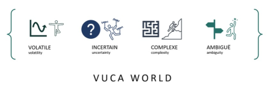
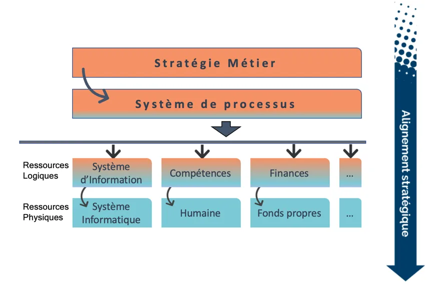
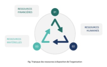
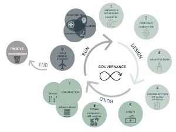
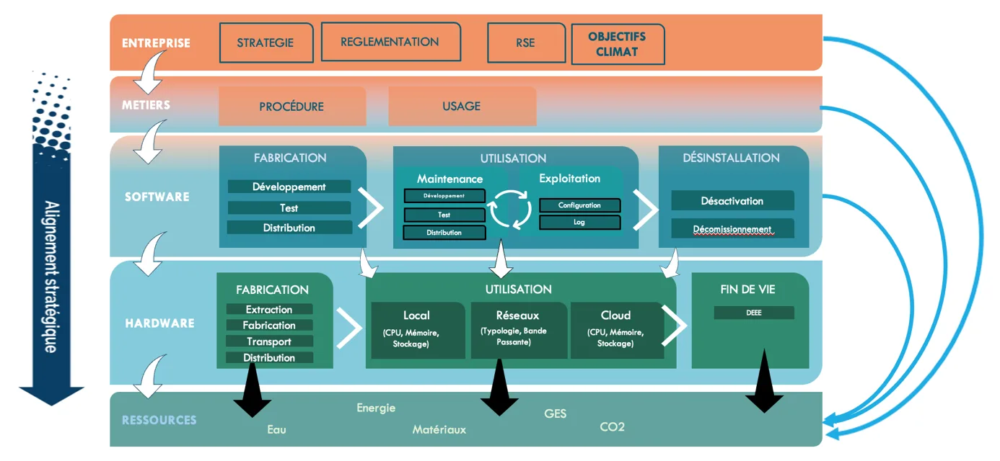
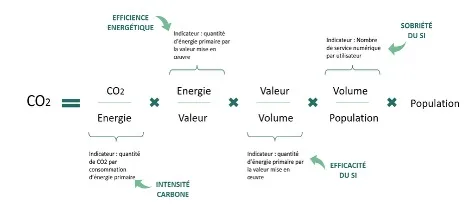
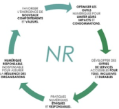
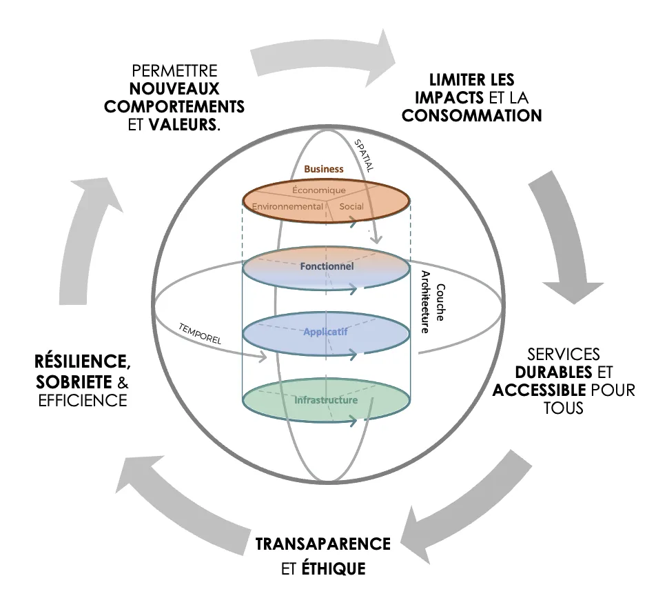
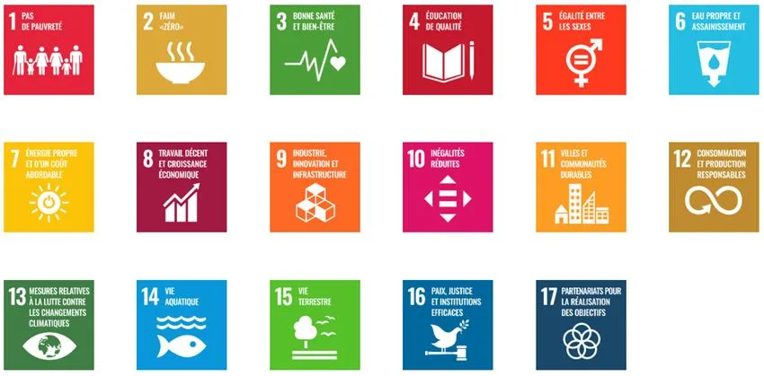
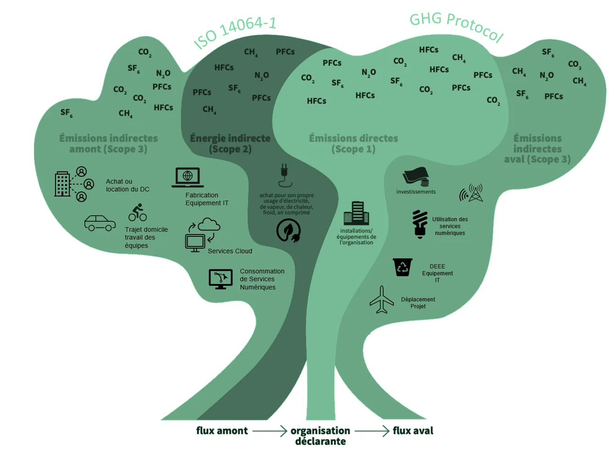

# Guide — les fondations

*Partie théorique du document de synthèse du GT AIR. La partie pratique est éclatée en [fiches](index.md#les-fiches-par-theme).*

---

## 1. Introduction & Posture

La transformation numérique et la transition écologique ne sont plus deux trajectoires parallèles : ce sont les deux faces d'une même réalité. Plus le numérique s'étend, plus il devient un poste de consommation de ressources — énergie, eau, métaux, mais aussi temps humain et capital. À l'échelle mondiale, le numérique pèse environ **10 % de l'électricité, 4 % de l'énergie primaire et 4 % des émissions de gaz à effet de serre** (The Shift Project, 2021-2023). Et la part dominante de cette empreinte ne se situe pas là où on l'attend : pour une DSI, **environ 80 % de l'empreinte d'un équipement est figée dès sa fabrication**, et le Scope 3 (chaîne de valeur) peut représenter **80 % de l'empreinte globale** d'une organisation.

Beaucoup ont longtemps pensé le Numérique Responsable (NR) comme une affaire de code propre ou de choix d'outils. Aujourd'hui, on comprend mieux la logique d'entreprise d'une telle démarche : les systèmes sont interconnectés, interopérables, imbriqués dans et hors de l'entreprise. **Le NR ne se joue plus au niveau du logiciel isolé, mais à l'échelle du Système d'Information dans son ensemble.**

**Le constat partagé.** De nombreuses organisations multiplient les bonnes intentions : un Digital Cleanup Day par an, un bilan carbone ponctuel, un audit d'accessibilité isolé. Ces initiatives sont louables mais souffrent d'un mal commun — l'absence de vision systémique. Le passage à franchir est clair : **de l'action ponctuelle et cosmétique à une stratégie intégrée, pilotée et pérenne.**

**La posture.** Le NR n'est ni un centre de coût, ni une contrainte réglementaire à subir. C'est un **levier de performance globale** — économique, opérationnelle, sociale et environnementale. Et l'architecte SI en est le pivot : non pas un simple expert technique, mais un **stratège qui aligne la technologie avec les enjeux de l'entreprise**.

> **Fil rouge.** Trois temps : les **fondations théoriques** (pourquoi et où agir), les **fiches pratico-pratiques** (comment agir), une **matrice de synthèse** et une **boîte à outils** réutilisables.

---

## 2. Partie théorique : les fondations

### 2.1 Le cadre : un monde VUCA et une DSI sous tension

Les organisations évoluent dans un monde dit **VUCA** — *Volatile, Uncertain, Complex, Ambiguous* (Bennis et Nanus, 1987). Crises économiques, sanitaires, énergétiques, raréfaction des matières premières : les règles du jeu ont changé.

Le temps où la DSI dépensait sans compter est révolu. **Chaque investissement, chaque ressource numérique consommée doit désormais être justifié et organisé.** On parle de sobriété, non par dogme, mais par nécessité. L'**urbanisation du SI** devient indispensable : faire mieux avec moins, en rationalisant l'existant.

<figure markdown>
  
  <figcaption>VUCA : un monde devenu volatile, incertain, complexe et ambigu.</figcaption>
</figure>

### 2.2 Pilier 1 — Gouvernance & alignement stratégique

Toutes les organisations partagent un besoin structurel : **bien gérer des ressources finies (financières, matérielles, humaines) au service de leurs objectifs.** C'est l'**alignement stratégique**. La stratégie de l'entreprise se retrouve dans chacune des briques numériques :

- un numérique **source d'impacts** environnementaux et sociétaux ;
- un numérique **levier** de réduction des émissions et de sobriété ;
- un numérique **catalyseur** de nouveaux modèles d'affaires.

**Un principe fondateur : on ne gouverne bien qu'à plusieurs.** Le NR exige une attente « ascendante » (terrain) et un soutien « descendant » (direction). Sans mandat clair, les exigences non-fonctionnelles (performance énergétique, accessibilité, durabilité) sont perçues comme des *nice-to-have* et sacrifiées.

<figure markdown>
  
  <figcaption>L'alignement stratégique : la stratégie métier irrigue les ressources logiques puis physiques du SI.</figcaption>
</figure>

> **Maturité ≠ performance.** Une organisation est *performante* si ses équipements portent un écolabel (ex. TCO). Elle est *mature* si elle a **explicitement exigé** cet écolabel à l'appel d'offres. On peut être performant par chance ; on n'est mature que par intention et par méthode.

### 2.3 Pilier 2 — Urbanisation & architecture en couches

L'urbanisation organise et **rationalise** le SI. Si deux outils font la même chose, n'en garder qu'un : simplification, économies de licences, de maintenance, de machines, d'énergie. Une cartographie à jour permet de **réduire de 20 à 30 % les coûts d'exploitation** (Forrester, 2021).

| Couche | Question | Ce qu'on y trouve |
|---|---|---|
| **Stratégie & Business** | Le « Quoi » | Vision, gouvernance, réglementaire, parties prenantes |
| **Métier** | Les savoir-faire | Processus → opérations → tâches |
| **Fonctionnelle** | L'organisation des fonctions | Zones, quartiers, îlots, blocs |
| **Applicative** | L'incarnation logicielle | Blocs applicatifs, sous-systèmes, données |
| **Technique** | Les services techniques communs | Middleware, services d'infrastructure |
| **Matérielle** | L'hébergement physique | Serveurs, postes, terminaux, réseau |

> **Rendre explicite ce que le modèle oublie.** Chaque couche génère des impacts sur deux dimensions invisibles : les **ressources environnementales** (énergie, eau, matières) et les **impacts sociaux/sociétaux**. Le GT AIR recommande d'ajouter une « couche ressources » au modèle.

<figure markdown>
  
  <figcaption>Triptyque des ressources à disposition de l'organisation : financières, humaines et matérielles.</figcaption>
</figure>

### 2.4 Pilier 3 — Cycle de vie (architecture, services, données)

Comprendre les cycles de vie, c'est savoir **où se cachent les impacts** et donc **quoi mesurer**.

**Cycle de vie d'un service numérique.** Tout service naît d'une **demande**, qui doit répondre à un **besoin** (pas une envie), créer de la **valeur mesurable**, servir la stratégie, et **ne pas déjà exister**. À l'usage : appliquer la **règle des 3U** — un service est-il **U**tile ? **U**tilisé ? **U**tilisable ?

<figure markdown>
  
  <figcaption>Le cycle de vie du SI piloté par la gouvernance : Design (vision, processus, architecture), Build (achats, construction), Run (usage), jusqu'à la fin de vie.</figcaption>
</figure>

**Cycle de vie des données — le grand oublié.**

- **52 % des données** d'un SI sont des **dark data** — stockées sans création de valeur (Veritas).
- **33 %** sont des données **ROT** — **R**edondantes, **O**bsolètes ou **T**riviales.

La parade : une **gouvernance de la donnée** (catalogue, registre, qualification chaud/froid). Attention : une donnée sans valeur *aujourd'hui* peut en créer demain — décommissionner avec discernement.

### 2.5 Pilier 4 — Cycle de vie du matériel & économie circulaire

**80 % de l'empreinte carbone d'un équipement provient de sa fabrication.** Le seul levier vraiment puissant : **l'allongement de la durée de vie** et la **circularité**. Trois axes :

1. **Réduction à la source** — réutiliser, réparer, reconditionner, prolonger *avant* d'acheter.
2. **Critères environnementaux (Green IT)** — durables, réparables (Indice de Réparabilité, TCO / EPEAT).
3. **Responsabilité sociale** — droits humains dans la chaîne, inclusion (ESAT).

En aval, gestion des **DEEE** et **économie circulaire locale** au-delà de la simple conformité.

<figure markdown>
  
  <figcaption>Les couches (Entreprise → Hardware) croisées avec le cycle de vie (fabrication, utilisation, fin de vie) et la « couche ressources » (eau, énergie, matériaux, CO₂).</figcaption>
</figure>

### 2.6 Pilier 5 — Architecture logicielle sobre (éco-conception)

L'éco-conception est la plus efficace quand **intégrée dès la conception**. Quatre familles de leviers :

- **Sobriété fonctionnelle** — règle des 3U (45 % des fonctionnalités ne servent jamais), standards ouverts (REST, JSON, ODF, CSV).
- **Sobriété technique** — poids des pages (EcoIndex), nombre de requêtes (YellowLab), poids des médias, audits statiques (EcoCode).
- **Durabilité** — rétrocompatibilité, auto-scaling, hébergeurs engagés.
- **Hygiène des environnements** — 25-30 % des serveurs tournent sans usage ; un serveur à <15 % de charge consomme jusqu'à 60 % de son énergie nominale. Consolidation : −30 à −60 %.

### 2.7 Pilier 6 — Mesure & pilotage (l'équation de Kaya appliquée au SI)

> *« On ne pilote que ce que l'on mesure. »*

L'**équation de Kaya** (1993) transposée au SI relie population des utilisateurs, volume de services, valeur produite, consommation d'énergie, intensité carbone. Axes de pilotage : **intensité carbone, efficience énergétique, efficacité du SI, sobriété**.

<figure markdown>
  
  <figcaption>L'équation de Kaya appliquée au SI : quatre leviers d'action — intensité carbone, efficience énergétique, efficacité et sobriété du SI.</figcaption>
</figure>

Un bon **KPI NR** croise quatre dimensions : les **5 axes du NR**, le **cycle de vie**, le **découpage en couches**, le triptyque **People / Planet / Profit**.

<figure markdown>
  
  <figcaption>Les axes du NR.</figcaption>
</figure>

| Couche | Optimiser les impacts | Inclusion & durabilité | Éthique & responsabilité | Résilience |
|---|---|---|---|---|
| **Fonctionnelle** | Taux d'usage des fonctionnalités | Taux d'utilisateurs capables | Données perso à but lucratif | Unicité des fonctions |
| **Applicative / Data** | Données utilisées ; qualité | Applications accessibles (WCAG) | Respect RGPD | Unicité de la donnée |
| **Technique** | Applications open source | API/frameworks accessibles | Sécurisation des données | Technos orphelines |
| **Matérielle** | Usage réel (CPU, RAM, I/O) | Terminaux accessibles | Écolabels ; % renouvelable | Serveurs à fonction identifiée |
| **Business** | Services / population | % mécénat de compétences | % femmes IT & turnover | Turnover équipes projet |

> **Les 5 axes du Numérique Responsable**
> 1. Un outil aux impacts et consommations limités.
> 2. Des offres de services accessibles, inclusives, durables.
> 3. Des pratiques éthiques et responsables.
> 4. Un numérique mesurable, transparent, lisible.
> 5. L'émergence de nouveaux comportements et valeurs.

<figure markdown>
  
  <figcaption>Vue d'ensemble : les 5 axes du NR enveloppent les couches d'architecture (Business → Infrastructure), selon les dimensions spatiale et temporelle.</figcaption>
</figure>

### 2.8 Le SI au service des ODD

<figure markdown>
  
  <figcaption>Les 17 Objectifs de Développement Durable de l'ONU. Le SI peut en adresser directement une partie (voir tableau).</figcaption>
</figure>

| ODD | Contribution du SI |
|---|---|
| **3** Santé & bien-être | Lutte contre dark patterns, temps d'écran ; substances dangereuses |
| **4** Éducation | Apprentissage continu, montée en compétences |
| **5** Égalité F/H | Lutte contre discriminations, accès aux directions |
| **6** Eau | Consommation des datacenters et de la fabrication |
| **7** Énergie durable | Efficience, renouvelables |
| **8** Travail décent | Conditions dans les centres de services sous-traités |
| **9** Infrastructure & innovation | Architecture résiliente et sobre |
| **10** Réduction des inégalités | Équité salariale |
| **12** Consommation responsable | Mesure des 3U, quotas |
| **13** Climat | Empreinte carbone par service |
| **17** Partenariats | Coopération public / privé / société civile |

---

## 4. Synthèse : la matrice architecte

Croise les grandes étapes de la démarche avec les couches d'architecture.

| Étape | Stratégie & Gouvernance | Métier | Application | Données | Techno / Infra |
|---|:---:|:---:|:---:|:---:|:---:|
| **G1. Initialiser** | ● | ○ | | | |
| **G2. Embarquer les PP** | ○ | ● | | | |
| **G3. Identifier les objectifs** | ● | ○ | | | |
| **M1. État des lieux** | | ○ | ● | ● | ● |
| **G4. Feuille de route** | ● | ● | | | |
| **C1→I1. Mettre en œuvre** | | ○ | ● | ● | ● |
| **V1. Maturité des PP** | ● | ● | ○ | ○ | ○ |
| **D2. Communiquer & valoriser** | ○ | ● | | | |

**Légende.** **●** Impact primaire · **○** Impact secondaire.

> **L'architecte, ambassadeur du Numérique Responsable.** Au terme du parcours, il devient le **promoteur actif** d'un numérique sobre, inclusif et résilient.

---

## 5. Boîte à outils & ressources

!!! tip "Le catalogue de référence"
    L'INR maintient une **[Boîte à outils du Numérique Responsable](https://sustainableit-tools.isit-europe.org/)**
    : 355 ressources (outils de mesure, référentiels, guides, MOOC et textes de loi)
    classées en 15 thèmes, avec recherche, filtres et vérification active des liens.

    La sélection ci-dessous en est un extrait commenté : les outils que le GT AIR
    tient pour structurants dans une démarche d'architecture. Pour un besoin pointu
    ou une veille, allez au catalogue. L'INR le met à jour en continu, quand cette
    page suit le rythme des relectures du GT.

*🟢 = outil open source ; les outils sans pastille ne le sont pas (ou partiellement).*

### Mesure & maturité
| Outil | Usage | Lien |
|---|---|---|
| 🟢 **WeNR** | Empreinte GES + maturité NR du SI (ACV simplifiée + questionnaire DINUM) | <https://wenr.isit-europe.org/> |
| 🟢 **MyImpact** (INR/ISIT) | Calculateur de l'empreinte numérique individuelle (sensibilisation) | <https://myimpact.isit-europe.org/fr/> |
| 🟢 **NumEcoEval** | Évaluation environnementale des SI | — |
| 🟢 **DataVizta** (Boavizta) | Impact fabrication/usage des équipements | <https://dataviz.boavizta.org/> |
| 🟢 **Guide Maturité PP (INR/ISIT)** | 47 questions, 10 familles | <https://institutnr.org/guide-maturite-parties-prenantes> |
| 🟢 **GPC-ONR** (INR) | Évaluation participative, priorisation et consolidation des Objectifs Numérique Responsable (ONR) | <https://github.com/Institut-du-Numerique-Responsable/GPC-ONR> |

### Éco-conception & accessibilité
| Outil | Usage | Lien |
|---|---|---|
| 🟢 **EcoIndex CLI** | Poids des pages, intégrable CI/CD | <https://github.com/cnumr/EcoIndex_python> |
| 🟢 **Lighthouse plugin EcoIndex** | Audit éco-conception | <https://github.com/cnumr/lighthouse-plugin-ecoindex> |
| 🟢 **YellowLab Tools** | Requêtes, poids, perfs front | <https://yellowlab.tools/> |
| **RequestMap** | Cartographie des requêtes | <https://requestmap.webperf.tools/> |
| 🟢 **Tanaguru** | Accessibilité (RGAA / WCAG) | — |
| 🟢 **GR491 (INR)** | Référentiel d'éco-conception | <https://gr491.isit-europe.org/> |
| **RGESN (ARCEP/ARCOM)** | Référentiel général d'éco-conception | <https://ecoresponsable.numerique.gouv.fr/publications/referentiel-general-ecoconception/> |
| 🟢 **Green Claude** (INR) | Skill d'éco-conception pour Claude Code : audit RGESN/GR491/GSF et sobriété IA dans l'IDE | [Présentation](https://institut-du-numerique-responsable.github.io/green-claude/) · [dépôt](https://github.com/Institut-du-Numerique-Responsable/green-claude) |
| 🟢 **Skill NR** (INR) | Règles d'éco-conception (RGESN, GR491, Opquast, RGAA) pour 11 assistants IA de code, en 13 langues | [Présentation](https://institut-du-numerique-responsable.github.io/skill-nr/) · [dépôt](https://github.com/Institut-du-Numerique-Responsable/skill-nr) |

### Achats & gouvernance
| Ressource | Usage | Lien |
|---|---|---|
| 🟢 **Clausier NR (INR)** | Clauses types CCTP/CCAP | <https://institutnr.org/clausier-numerique-ecoresponsable> |
| **Dispositif RFAR** | Charte + Label d'État (ISO 20400) | <https://www.economie.gouv.fr/mediateur-des-entreprises> |
| 🟢 **Guide bonnes pratiques NR (INR)** | Référentiel | <https://institutnr.org/guide-bonnes-pratiques-nr> |
| **Guide achats responsables (DINUM)** | Achats | <https://ecoresponsable.numerique.gouv.fr/publications/guide-pratique-achats-numeriques-responsables/> |
| **Label NR** (LUCIE × INR × ADEME) | 14 principes, 2 niveaux | <https://label-nr.fr/referentiel-numerique-responsable/> |
| **Charte IA Responsable** (INR) | Cadre d'engagement pour une IA éthique, inclusive, éco-responsable et de confiance ; complète l'AI Act, qui impose des obligations sans dire comment faire | <https://charter.isit-europe.org/charte-ia/?lang=fr_FR> |

### Formation & sensibilisation
| Ressource | Usage | Lien |
|---|---|---|
| 🟢 **MOOC Numérique Responsable** (Académie NR) | Montée en compétences NR (cf. fiche [G2](fiches/G2-parties-prenantes.md)) | <https://www.academie-nr.org/mooc-nr/fr/index.html> |
| 🟢 **MOOC IA Responsable** (Académie NR) | Comprendre et encadrer l'IA responsable | <https://www.academie-nr.org/mooc-ia/fr/index.html> |
| 🟢 **MyImpact** (INR/ISIT) | Calculateur d'empreinte individuelle, support d'ateliers | <https://myimpact.isit-europe.org/fr/> |

### Communication responsable (ADEME)
- ImpactCO₂ : <https://impactco2.fr/outils/numerique>
- Communication responsable : <https://communication-responsable.ademe.fr/>
- Guide anti-greenwashing (2025) : <https://librairie.ademe.fr/>

---

## 6. Glossaire

<figure markdown>
  
  <figcaption>Les trois scopes du Bilan GES (GHG Protocol / ISO 14064) : émissions directes (Scope 1), indirectes liées à l'énergie (Scope 2), et indirectes de la chaîne de valeur (Scope 3, jusqu'à 80 %).</figcaption>
</figure>

| Terme | Définition |
|---|---|
| **ACV** | Analyse du Cycle de Vie — impacts sur toutes les phases (fabrication, distribution, usage, fin de vie). |
| **Dark data** | Données conservées sans création de valeur (~52 % d'un SI). |
| **DEEE** | Déchets d'Équipements Électriques et Électroniques. |
| **Éco-conception** | Intégration des critères environnementaux dès la conception. |
| **ESN** | Entreprise de Services du Numérique. |
| **GES / GHG** | Gaz à Effet de Serre / Greenhouse Gas Protocol (Scopes 1, 2, 3). |
| **Maturité (vs performance)** | Capacité à connaître et faire respecter les meilleures pratiques. |
| **NR** | Numérique Responsable. |
| **ODD** | Objectifs de Développement Durable (ONU, 17). |
| **ONR** | Objectifs Numérique Responsable, déclinaison des ambitions NR en objectifs pilotables. |
| **OKR** | Objectives & Key Results. |
| **PUE** | Power Usage Effectiveness — efficacité énergétique d'un datacenter. |
| **RFI / RFP** | Request For Information (maturité) / Request For Proposal (performance, contractuel). |
| **RGAA / WCAG** | Référentiels d'accessibilité (français / international). |
| **RGESN** | Référentiel Général d'Écoconception des Services Numériques. |
| **ROT** | Données Redondantes, Obsolètes ou Triviales (~33 % d'un SI). |
| **Règle des 3U** | Un service est-il **U**tile, **U**tilisé, **U**tilisable ? |
| **Scope 3** | Émissions indirectes de la chaîne de valeur (jusqu'à 80 %). |
| **TTL** | Time To Live — durée de vie programmée d'un environnement. |
| **VUCA** | Volatile, Uncertain, Complex, Ambiguous. |

---

*Document fusionnant le Livre Blanc AIR (INR, 2024), le Guide des Bonnes Pratiques AIR (2026) et le Guide d'évaluation de la maturité NR des parties prenantes (INR/ISIT, 2024).*

!!! quote "Crédits & licence des illustrations"
    Schémas et illustrations issus des publications du GT AIR de l'**Institut du Numérique Responsable (INR / ISIT)**, diffusés sous licence **[CC BY-SA 4.0](https://creativecommons.org/licenses/by-sa/4.0/deed.fr)**. Toute réutilisation doit créditer l'INR/ISIT et conserver la même licence.
