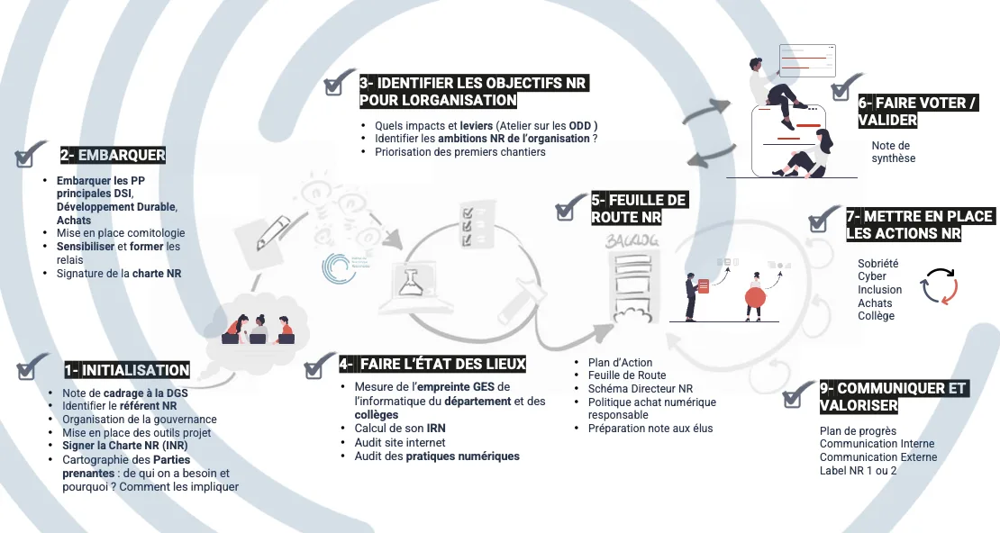

# Architecture Informatique Responsable

### De la théorie à l'action : concevoir, piloter et faire rayonner un Système d'Information responsable

*Espace de travail collaboratif du Groupe de Travail AIR — Institut du Numérique Responsable (INR / ISIT).*

<figure markdown>
  
  <figcaption>Le parcours de la démarche, du lancement à la valorisation (cliquer pour agrandir).</figcaption>
</figure>

---

Ce site rassemble deux niveaux de lecture :

- **[Le guide](guide-unifie.md)** — les fondations théoriques : pourquoi et où agir (6 piliers, matrice architecte, boîte à outils, glossaire).
- **Les fiches de bonnes pratiques** — comment agir, dès demain. Une fiche = un fichier, co-écrit par le GT.

## Les fiches, par thème

| Thème | Fiches |
|---|---|
| **Gouvernance & Stratégie** | [G1 Mandat](fiches/G1-mandat.md) · [G2 Parties prenantes](fiches/G2-parties-prenantes.md) · [G3 Objectifs & ODD](fiches/G3-objectifs-odd.md) · [G4 Feuille de route](fiches/G4-feuille-de-route.md) |
| **Mesure & Diagnostic** | [M1 Diagnostic](fiches/M1-diagnostic.md) · [M2 Pilotage & KPI](fiches/M2-pilotage-kpi.md) |
| **Conception sobre** | [C1 Éco-conception des services](fiches/C1-eco-conception-services.md) · [C2 Cycle de vie des données](fiches/C2-cycle-vie-donnees.md) · [C3 IA sobre](fiches/C3-ia-sobre.md) · [C4 Dette d'intégration](fiches/C4-dette-integration.md) · [C5 Accessibilité](fiches/C5-accessibilite.md) |
| **Infrastructure & Matériel** | [I1 Infrastructures & environnements](fiches/I1-infrastructures.md) · [I2 Achats responsables](fiches/I2-achats-responsables.md) · [I3 Résilience & sobriété](fiches/I3-resilience.md) |
| **Chaîne de valeur** | [V1 Maturité des parties prenantes](fiches/V1-maturite-parties-prenantes.md) · [V2 Souveraineté & réversibilité](fiches/V2-souverainete.md) |
| **Déploiement & Valorisation** | [D1 Conformité](fiches/D1-conformite.md) · [D2 Communiquer & valoriser](fiches/D2-communiquer-valoriser.md) |

## Contribuer

Chaque fiche s'édite en Markdown, directement sur GitHub (bouton crayon ou touche `.` pour l'éditeur web). Voir le [guide de contribution](https://github.com/Institut-du-Numerique-Responsable/BP-AIR/blob/main/CONTRIBUTING.md) et le modèle de fiche dans le dépôt. Le site se reconstruit automatiquement à chaque modification validée.

> **Principes directeurs transversaux** — Approche holistique · Démarche itérative (*Mesurer → Agir → Apprendre → Ajuster*) · Pilotage par la valeur · Gouvernance collaborative.
